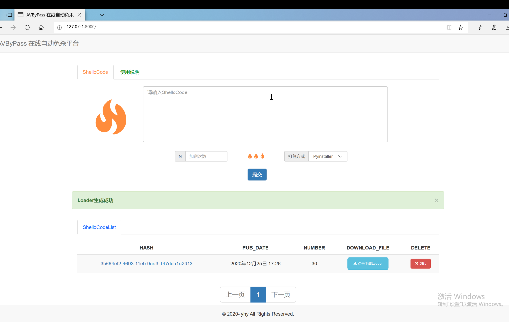
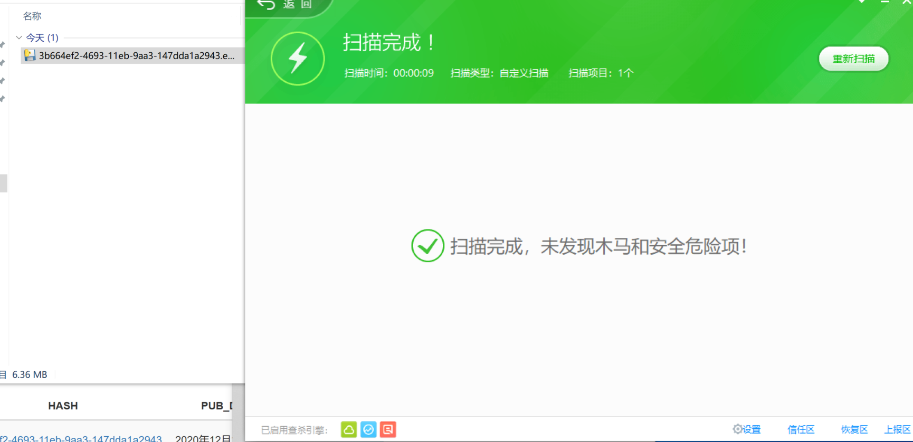

一款利用加载器以及Python反序列化绕过AV的在线免杀工具

### 因为打包方式的局限性，**不能跨平台**，若要生成exe格式的只能在**Windows**下运行本项目

### 打包速度有点慢，提交后稍等一会

## 开发环境及运行

前端使用[Bootstrap](https://www.runoob.com/bootstrap/bootstrap-tutorial.html)框架，后端使用[Django](https://www.runoob.com/django/django-template.html)框架 。

在项目根目录下运行`pip3 install -r requirements.txt` 安装相关依赖

使用 `python3 manage.py runserver 0.0.0.0:8000`启动程序, 

**若要使用其他端口作为访问端口，同时需要修改shellcode目录下的shellcode.py文件的13行的端口号。**

## 使用说明

> - ShellCode
> -    输入如CobaltStrike生成的python版payload.py文件中的buf = "xxxxx" 的 xxxxx
>
> - 加密次数
> -    通过简单的修改加密次数来绕过360不断网的情况下，免杀效果只有一会的情况
>
> - 打包方式
> -    目前只支持Pyinstaller一种打包方式，需要其他打包方式的可通过修改index.html的58行和shellcode目录下 的views.py的65行，增加自己的打包方式

## 其他

本项目的主要免杀逻辑在shellcode目录下的views.py文件的create_loader 函数 和 shellcode.py 文件

## 免责声明

本工具仅能在取得足够合法授权的企业安全建设中使用，在使用本工具过程中，您应确保自己所有行为符合当地的法律法规。 
如您在使用本工具的过程中存在任何非法行为，您将自行承担所有后果，本工具所有开发者和所有贡献者不承担任何法律及连带责任。
除非您已充分阅读、完全理解并接受本协议所有条款，否则，请您不要安装并使用本工具。
您的使用行为或者您以其他任何明示或者默示方式表示接受本协议的，即视为您已阅读并同意本协议的约束。

## 参考

- 酒仙桥六号部队的[利用加载器以及Python反序列化绕过AV](https://mp.weixin.qq.com/s?__biz=MzAwMzYxNzc1OA==&mid=2247488583&idx=1&sn=836087cd9cb77a9b7880a510e48efba4&chksm=9b3932f6ac4ebbe00b2abc6acfa78aea788a39ae90d75cf2e55f0c77b3722058865dcab298e5&scene=0&xtrack=1#rd)
- Jaky师傅的[利用Python反序列化运行加载器实现免杀](https://my.oschina.net/u/4581868/blog/4380404)
- [Bootstrap](https://www.runoob.com/bootstrap/bootstrap-tutorial.html)框架
- [Django](https://www.runoob.com/django/django-template.html)框架 

